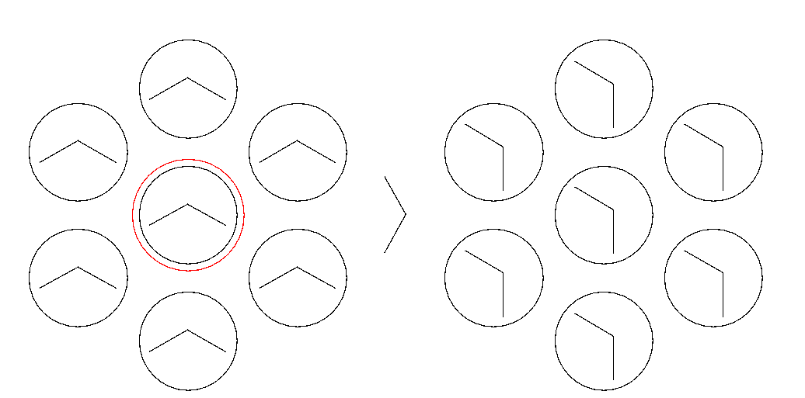
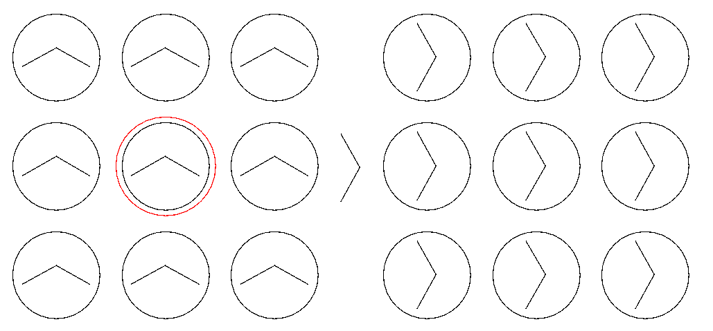
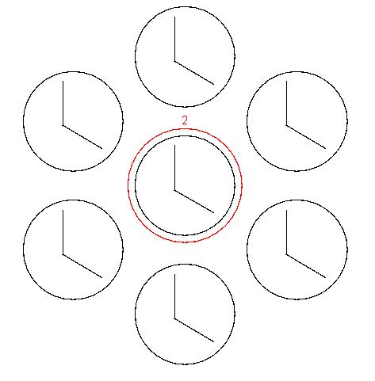

# Arrow Puzzle from Idle Exponential

## Instructions:

The game has two modes: one with a hexagonal grid, and one with a square grid.

Clicking a circle will rotate all adjacent circles as well as itself

A hint button is available at the bottom of the screen which will locate a circle and display the number of times it needs to be rotated.
Each hint adds 10 seconds to the timer.

There is no button to turn the music off, it is meant to be an added challenge to deal with.

## How the code works:

### The hexagonal grid
The hexagonal grid is stored as a 2d array of ints, similar to the square grid.
However, the length of each array in the 2d array is equal to 6 * the index with the exception of the array at the 0 index which has a length of 1.
The indices increment going around the hexagon in a clockwise fashion.
